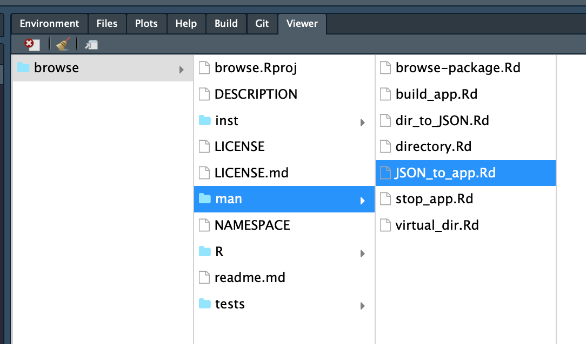
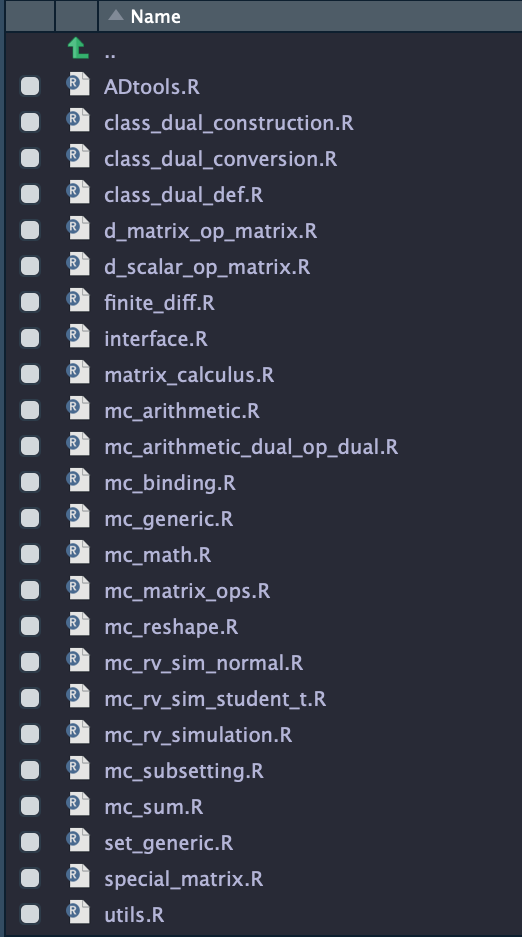
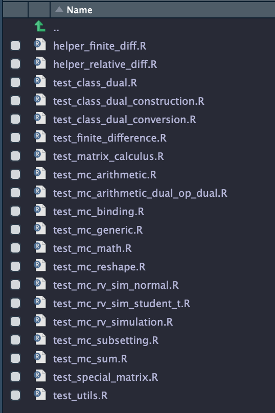
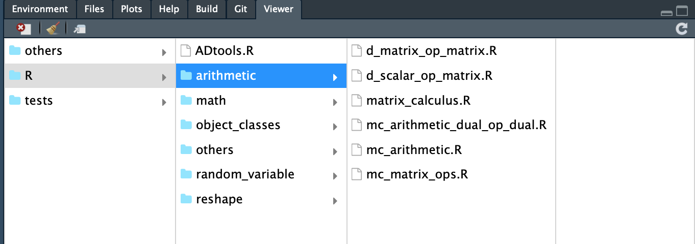
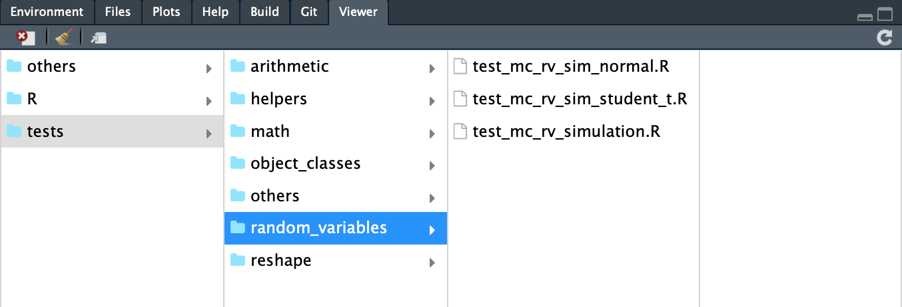
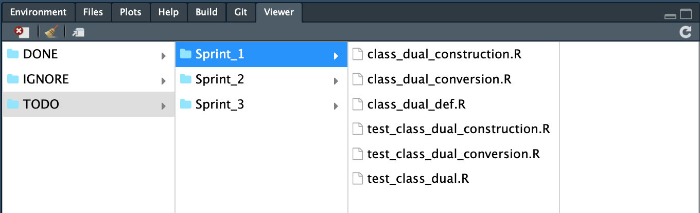
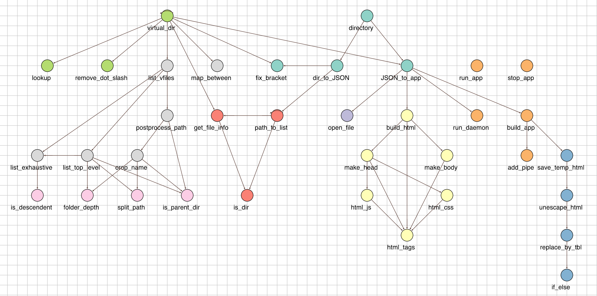

## R package 'browse'
Implements a file browser using [`finder.js`](https://mynameistechno.github.io/finderjs/) to be used temporarily until RStudio changes to (hopefully) a multi-column file browser with easy navigation. A key feature of the package is that it supports the use of virtual directory to re-map files without changing the underlying directory structure. This allows us to effectively create subdirectories within the R package folder, and more generally close the gap between the mental space (how we think about the files) and the workspace (how the files are organised). See more detail in Usage 2 below.


### Usage 1
```
handle <- browse::directory("./")  # start app
browse::stop_app(handle)           # stop app 
```

#### Screenshot

<p align = 'center'>
    
    <div align="center"> Figure 1: File browser in RStudio: Double click to open file / Navigate with arrows then open file with enter. </div>
</p>


### Usage 2
How files are stored does not necessarily need to be how they are used. This distinction is particularly useful since R package skeleton does not support sub-directories within the R folder. Here is an example how one may use this package to organise their files. 

#### 2.1 Original directory: the `R` folder and the `tests` folder
<p align="center">
  
  
  <div align="center"> Figure 2: Original directory </div>
</p>

#### 2.2a Grouping by modules using virtual directory
<p align="center">
  
  
  <div align="center"> Figure 3: Grouping by modules </div>
</p>

Effectively we now have the support of subfolders without making any changes at all to the original directory. The key message here is again how files are stored do not need to be how they are presented / used. 

#### 2.2b Grouping by workflow using virtual directory
<p align="center">
    
  <div align="center"> Figure 4: Todo list style </div>
</p>

This allows pooling together the R files and the corresponding test files, and organising them into [sprints](https://www.atlassian.com/agile/scrum/sprints).

#### 2.3 Code

##### 2.31 Setup
To create the above, one first defines a mapping between the actual directory and the virtual directory (\*I used spreadsheet to create the mapping). The mapping should look like the following:

```
# Example 1: Grouping by modules
> head(eg1, 10)
             Target                         Source
1  R/object_classes    R/class_dual_construction.R
2            others                      NAMESPACE
3                 R                    R/ADtools.R
4      R/arithmetic            R/matrix_calculus.R
5      R/arithmetic         R/d_matrix_op_matrix.R
6      R/arithmetic R/mc_arithmetic_dual_op_dual.R
7         R/reshape                 R/mc_generic.R
8            others            man/zero_matrix0.Rd
9      R/arithmetic         R/d_scalar_op_matrix.R
10        R/reshape                 R/mc_binding.R
```

```
# Example 2: Grouping by workflow
> head(eg2, 9)
         Target                                           Source
1        IGNORE                                    ADtools.Rproj
2        IGNORE                                      codecov.yml
3          DONE                                      DESCRIPTION
4        IGNORE                                        dev/dev.R
5 TODO/Sprint_1                      R/class_dual_construction.R
6          DONE                                R/mc_subsetting.R
7 TODO/Sprint_2 tests/testthat/test_mc_arithmetic_dual_op_dual.R
8 TODO/Sprint_3           tests/testthat/test_mc_rv_sim_normal.R
9          DONE                      tests/testthat/test_utils.R
```

The right column is the listing of the source directory generated by the call `list.files(., recursive = T)`, and the left column is the (virtual) folder structure one wants. **The mental model to keep in mind is that the right column is the list of files (i.e. no folders), and the left column is the (virtual) path (i.e. folders exclusively) to map to.**

The entries in the left column should follow strictly the two rules below:

1. The parent directory `"."` (or `"./"`) should be typed as simply `""`, the empty string.
2. Each entry must start and end with characters, i.e. no `"/"` at the front and at the back.

##### 2.32 Launch the file browser
Once you have the mapping, do the following to start (and stop) the app.

```
library(browse)

# Create a virtual directory
ADtools_vdir <- virtual_dir$new(eg1$Target, eg1$Source)

# Start and Stop the app as usual
handle <- ADtools_vdir$directory(skip_first_level = T, reminder = F)
stop_app(handle)
```

The `skip_first_level = T` skips the column that contains (only) the parent directory. `reminder = F` switches off the reminder about assigning the result to a variable. **Note that if one does not store this variable, the next line would not work and one needs to resort to the system tools like task managers to stop the app!** 


### Remarks
- At the moment, the package opens file via the system command (`open` in Mac and `rstudio` in Windows and Linux), and it requires that only one RStudio window is opened. If more than one window is opened, it is up to the system to decide which window to use. 

<!--
- For the ones who are interested, the package works roughly as follows. 
Directory -> JSON -> [finder.js](https://mynameistechno.github.io/finderjs/) -> R -> System call.
-->

- Generally, it is not a very good idea to let a webapp (albeit running locally) to have access to the system command line facility. See `file_control.R` for the exact system call made by this package if in doubt.


### Package structure
<p align="center">
    
    <div align="center"> Package structure generated by the <a href="https://github.com/kcf-jackson/funGraphs" rel="nofollow"><code>funGraphs</code></a> package. Each color represents a file.</div>
</p>


<!--- 
TODO List
- DONE Daemonise file browser
- DONE Fix keyboard navigation
- DONE Remapping of files
- DONE Support Windows and Linux
- TODO Multiple remap (?)
--->
